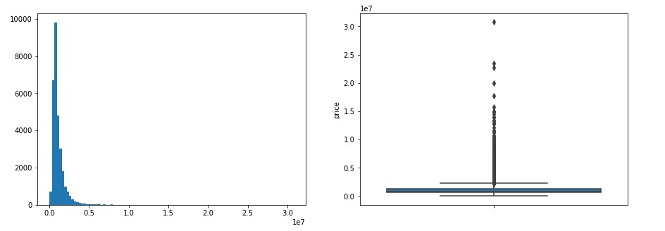
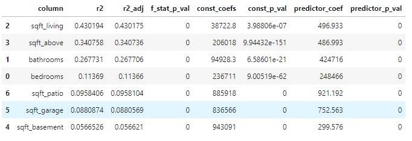
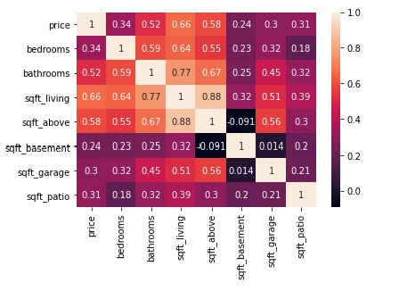
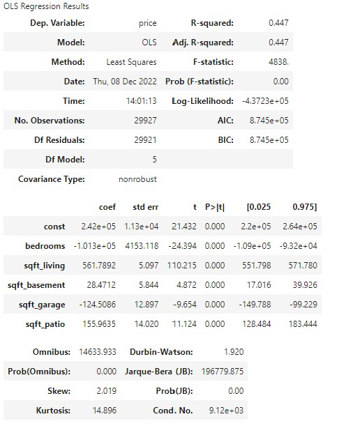
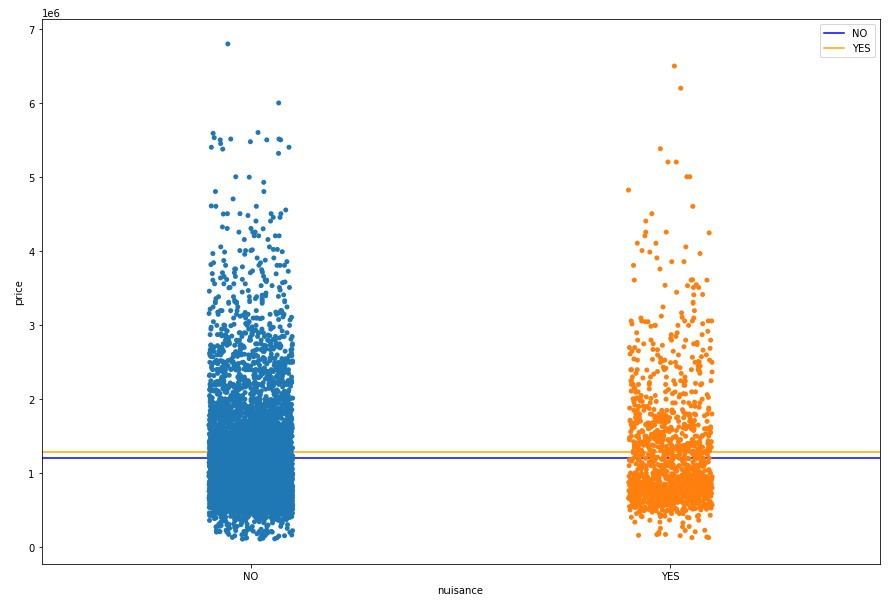
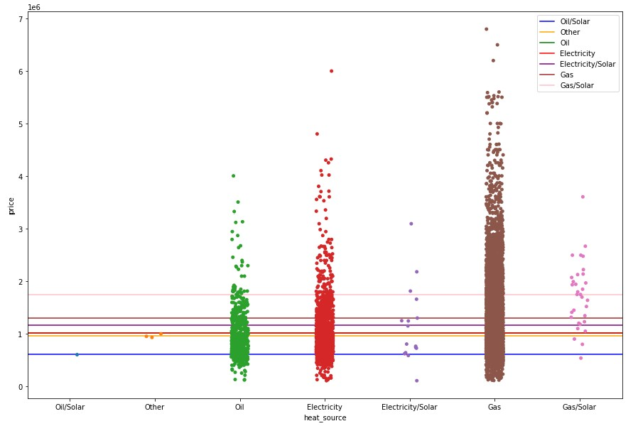
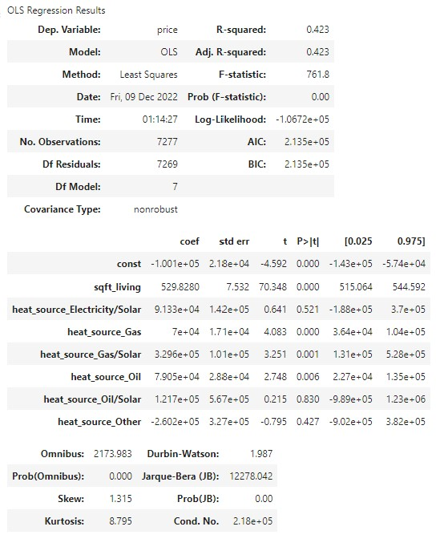
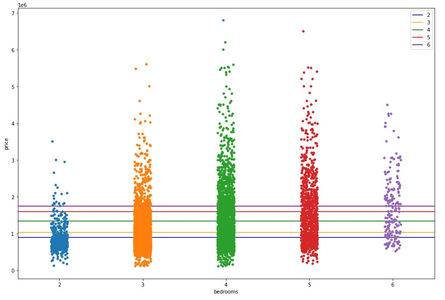
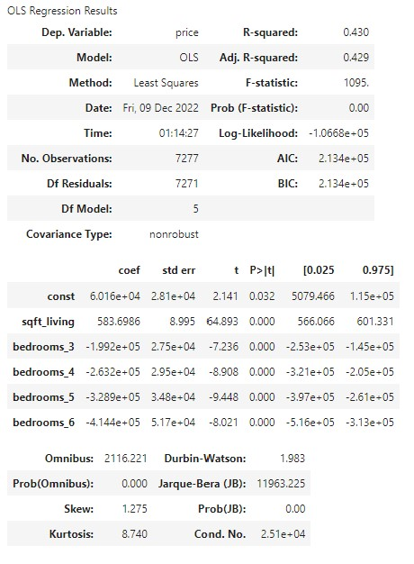
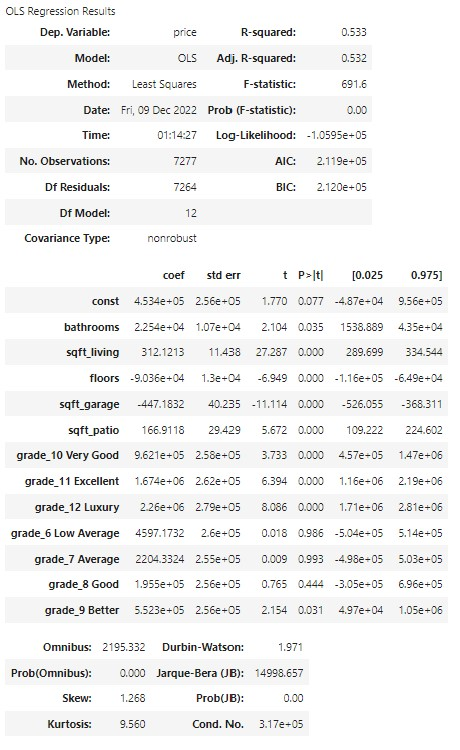

# King-County-Real-Estate-Analysis
# Renovation And House Price

Presented by Matthew Duncan, Leif Schultz, and Jasmine Huang

## Main Goals
We are advising a real estate agency tasked to help potential home sellers decide what renovations to make for increasing their home value.
First priority is to find the most highly correlated numerical features that can be changed to increase home value.
Second priority is to find what categorical features that can be changed to increase home value.
Third priority is to correct models assumptions.

## The Data
King County House Sales dataset: kc_house_data.csv

## Modules:
import numpy as np
import scipy.stats as stats
import matplotlib.pyplot as plt
import seaborn as sns
import pandas as pd
import statsmodels.api as sm
import warnings
warnings.filterwarnings('ignore')
from sklearn.metrics import mean_absolute_error, mean_squared_error
import num_model_all_combos as simple_test

### Table of Contents:
- Importing our Libraries
- Importing our Data
- initial baseline model
- initial data cleaning
- numerical data
  - tests
      - simple and multi-linear regressions
      - scaling
      - logging data
      - polynomials
  - conclusions
- categorical data
  - tests
    - condition
    - nuisance
    - heat
    - grade
  - conclusions
- final results

### Initial Baseline Model

#### Correlation
- Set 'price' as the target for our model.  Find the correlations between features and price.

- sqft_living      0.608616
- sqft_above       0.538631
- bathrooms        0.480337
- sqft_patio       0.313789
- bedrooms         0.288954
- sqft_garage      0.263674
- sqft_basement    0.245005
- floors           0.180589

To get an initial understanding of our data, we are building a baseline model based on the feature sqft_living since it has the highest correlation to our target feature: price.

### Initial Data Cleaning

#### Dropping Outliers in our Target = "price"

We modeled the target data to check its shape and to determine whether there were outliers that could be affecting our data. After looking at histograms
and box plots of price, it was decided to remove any values above or below three standard deviations of the mean. This small adjustment allowed us to clean
the dataset while only removing .6% of the data.

#### Dropping Features that do not Pertain to the Business Question
These columns are not relevant for a variety of reasons:
- Drop ID: just a unique identifier, no helpful information
- Drop adress and lat/long: Location not important in this analysis
- Drop year renovated and year built: not relevant for remodeling purposes
- Drop date: last sale date is not relevant to remodeling home
- Drop sq ft lot: Cannot change lot size by remodeling home
- Waterfront: remove, we cannot change the house location to be moved next to water
- Greenbelt: remove, we cannot change the house location to be moved next to a greenbelt
- View: remove, we cannot change the house location to have a good view
- Sewer System: not likely to change your entire sewer system during a home remodel

#### Outliers in our Predictor variables
- Drop outliers in 'bedrooms', 'sqft_living', 'sqft_above': lower than 0.3 percentile amd higher than 99.7 percentile

#### Numerical Data
Creating a DataFrame with just continuous numerical data
To run an enhanced simple linear regression model and eventually run multi-lineear regression models, we created a dataframe using only the numerical
features in the dataset:
- Bedrooms
- Bathrooms
- Sqft_living
- Sqft_above
- Sqft_basement
- Sqft_garage
- Sqft_patio

### Second Simple Linear Regression Model (After Dropping Outliers in Sale Price)
We needed to run a second simple linear regression model after dropping our outliers to ensure that the model improved after making the changes.
To compare the linear models against our results against the simple correlation table run above, we use the function, simple_num_model_all_combos,
found in the included .py file. This function runs a simple linear regression model on all predictor features in a dataframe against the specified 
target feature.

Our simple linear regression model once the outliers in price have been dropped has an R-squared value of .43, increased from the baseline results of .37.

### Checking for Multicollinearity
Before we run a multi-linear regression model, we need to ensure that we reduce the multicollinearity within our dataset. To do this, we ran a heat map
of the correlation between all features. Two features had correlations above our threshold of .75: sqft_living/bathrooms and sqft_living/sqft_above. 
Since sqft_living has the highest correlation with our target variable, we have dropped bathrooms and sqft_above from future modeling attempts.

### Baseline Multi-Linear Regression Model
Now that our data has been cleaned, we have our improved simple linear model, and we have dropped features that are highly correlated in an attempt to 
reduce multicollinearity, we can check our results using multi-linear regression.

To compare the multi-linear regression models and find the absolute best fit, we use the function, multi_num_model_all_combos, found in the included .py file. 
This function runs a multi-linear regression model for all combinations of predictor features in a given dataframe against the specified target feature.

We found that the combination of all 5 of the remaining predictor variables has the highest adjusted R-squared value (.447) and all coefficient p-values 
are statistically significant. We will be using these variables from now on as we move forward.

#### Results of model:
Our model explains about 44.7% of the variance in our data
Our models F-statistic is statatistically significant compared to our alpha of 0.05
All coefficient are statistically significant when compared to our alpha of .05

#### Interpretations:
For a house with no bedrooms, sqft_living, sqft_basement, sqft_garage, or sqft_patio we would expect the house to be valued about $242,000
For each additional bedroom, we would expect the home to lose value of about $101,000
For each additional 1 square foot in living space size, we would expect the house to gain about $561
For each additional 1 square foot in basement size, we would expect the house to gain about $28
For each additional 1 square foot in garage size, we would expect the house to lose about $125
For each additional 1 square foot in patio size, we would expect the house to gain about $155

#### Standardizing the Data to Determine Importance
Since our data includes variables of different scale, we need to standardize our model to determine importance. Once standardized, we can check 
the coefficients of our variables and the predictor with the highest coefficient is the one with the greatest impact to our home value.

After standardizing our dataset, we are able to see that sqft_living has the highest coefficient (.74) with the number of bedrooms coming in second (-.14).

#### Checking Partial Regression Plots for our Model
Now we can check partial regression plots for our model. The goal is to show the marginal contribution of each particular predictor. These models correlate 
with the slope of the coefficient in our standardized model. Those with a higher value for the absolute value of the slope have a larger impact on our modeling.

We can see that each plot shows a linear relationship with a non-zero slope meaning that it is beneficial to add each of these features to the model.

#### Checking for Linearity and Normal Distributions
Now that our data is standardized, we also run a scattermatrix of the variables to get a better visual representation of what we're working with and to 
ensure that our data is as normal and linear as possible.

#### Logging all of the Predictor Variables
In an attempt to improve the linearity and normalcy of our dataset, we log all of our predictor values and run the scattermatrix to compare to our previously
standardized data.

Our data is much less linear than before scaling and we are unable to run our model for any of the predictor variables due to NaNs that appeared after taking 
the log of our predictor variables. This is not a good approach and we will not be prusuing this.

#### Categorical Data
Now that we have a good baseline for our simple and multi-linear regressions when looking at just numerical data, we can take a look at our categorical data 
and model the results.

##### Start with the condition of the house

1 = Poor; 2 = Fair; 3 = Average, 4 = Good, 5= Very Good

###### Checking correlation between condition and price

###### Model result

###### Lets try looking at nuisance: Correlation and Model Result

###### Lets try looking at heatsource: Correlation and Model Result

###### Grade: Correlation and Model Result

###### Bedroom: Correlation and Model Result

### Now running categories along with multilinear regression

## Results
the model explains about 52.3% of the variance in the data overall
the model is statistically significant
p-values for all numeric feature coeficients are statistically significant
p-values for 4 of the 11 grades are statistically significant
The MAE for our final model came in at a variance of about $326,782 dollars

## Interpretation
When looking at the standardized model, we see that sqft living and basement sq ft have the highest coef

This means that they will have the most drastic change to the model at scale and should be prioritized
when we look at our regular model we can get some good interpretation taking everything else into consideration

given a substandard quality house with no bedrooms, no living sq ft, and no basement sqft, we would expect the house to be priced about $214,100
for every increase in bedroom by 1, we would expect the house value to drop by $28,320
for every increase in 1 square ft of living area, we would expect the house value to increase by about $281
for every increase in 1 square ft of basement area, we would expect the house value to increase by about $107
We see statistically significant coefficients for building grade which represents the construction quality of improvements. We see that compared to a substandard 
home:

'very good' quality improvements would increase home value by about $1,102,000
'Excellent' quality improvements would increase home value by about $1,669,000
'Luxury' quality improvements would increase home value by about $2,034,000
'Mansion' quality improvements would increase home value by about$2,185,000
Recommendations
We recomment increasing the size of your home as the greatest impact to your renovation, first focusing on the total living area sq ft, then looking at basement 
area sq foot as a secondary (obviously this would be much more expensive then building above ground too)
We recommend spending the extra dollars for quality craftsmanship as these pay off in the long run with vastly greater home values

## Final Conclusions and Recommendations

## Nest steps amd Additional Information

