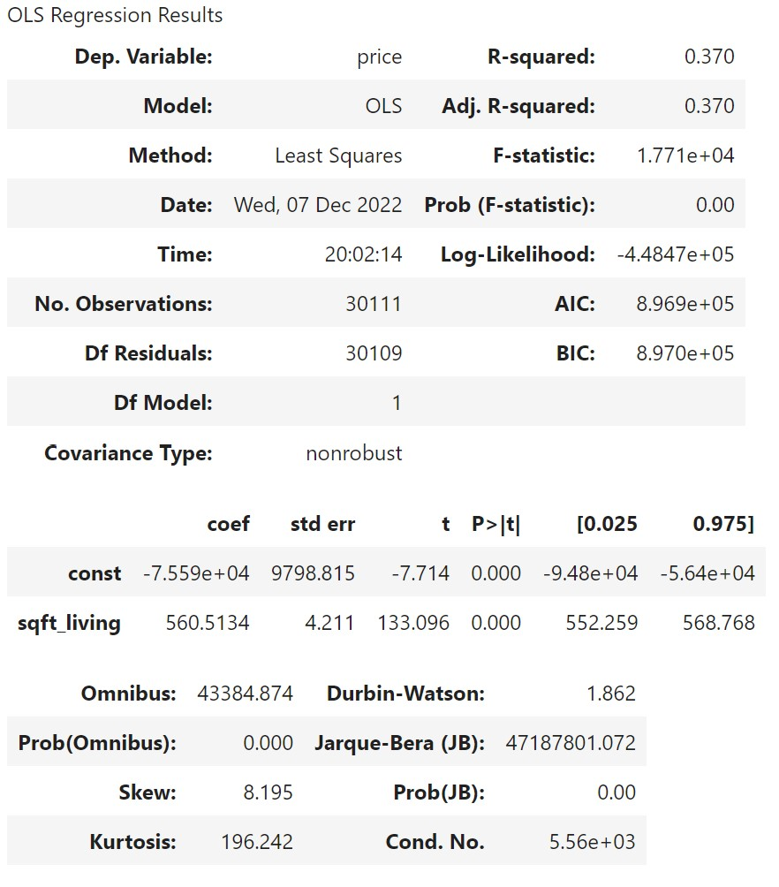

# King-County-Real-Estate-Analysis
# Renovation And House Price

Presented by Matthew Duncan, Leif Schultz, and Jasmine Huang

## Main Goals
We are advising a real estate agency tasked to help potential home sellers decide what renovations to make for increasing their home value.
First priority is to find the most highly correlated numerical features that can be changed to increase home value.
Second priority is to find what categorical features that can be changed to increase home value.
Third priority is to correct models assumptions.

## The Data
King County House Sales dataset: kc_house_data.csv

## Prepare Data: Slecting and Cleaning
1. Cut outliers in price: select price range between 0.3 percentile and 99.7 percentile. 
2. Decide what columns/features to drop: 'id', 'address', 'lat', 'long', 'yr_built', 'date', 'sqft_lot', 'waterfront', 'greenbelt', 'view', 'yr_renovated', 'sewer_system'.
  - Drop ID: just a unique identifier, no helpful info
  - Drop adress and lat/long: Location not important in this analysis
  - Drop year renovated and year built: not relevant for remodeling purposes
  - Drop date: last sale date is not relevant to remodeling home
  - Drop sq ft lot: Cannot change lot size by remodeling home
  - Waterfront: remove, we cannot change the house location to be moved next to water
  - Greenbelt: remove, we cannot change the house location to be moved next to a greenbelt
  - View: remove, we cannot change the house location to have a good view
  - Sewer System: not likely to change your entire sewer system during a home remodel
4. Recognize numerical and categorical features.

## Correlation
Set 'price' as the target for our model.  Find the correlations between features and price.

- sqft_living      0.608616
- sqft_above       0.538631
- bathrooms        0.480337
- sqft_patio       0.313789
- bedrooms         0.288954
- sqft_garage      0.263674
- sqft_basement    0.245005
- floors           0.180589

## Modles:
1. Set up a baseline modle using  y = 'price' and X = 'sqft_living'

3. 

