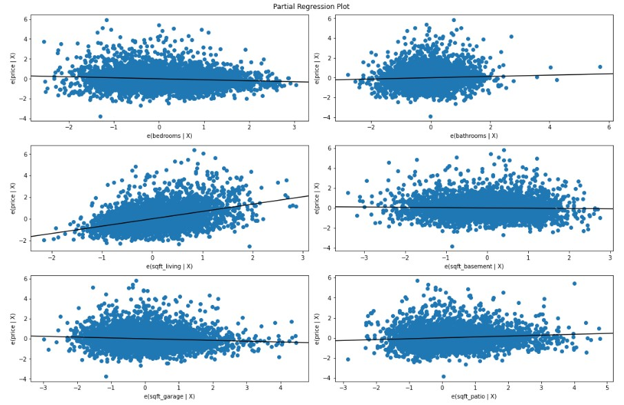
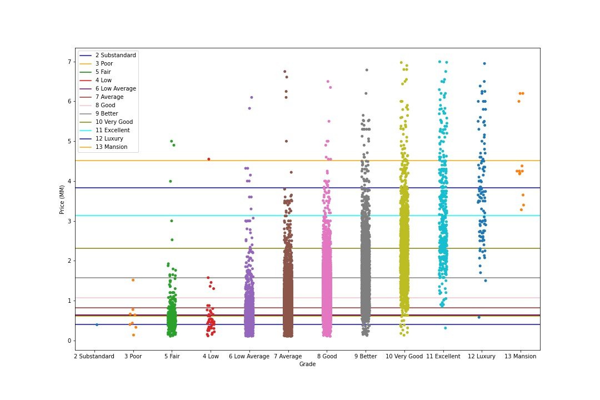
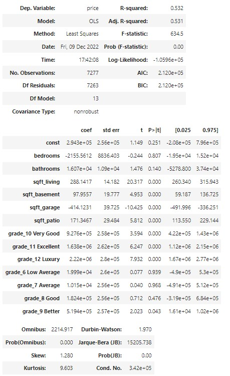

# King-County-Real-Estate-Analysis
# Renovation And House Price

**Authors**: [Matthew Duncan](mailto:mduncan0923@gmail.com), Leif Schultz, and Jasmine Huang

## Overview
We analyzed data from the King County, WA housing dataset to determine which house features renovations would add the most value to a house.

## Main Goals
We are advising a real estate agency tasked to help potential home sellers decide what renovations to make for increasing their home value.

- First priority is to find the most highly correlated numerical features that can be changed to increase home value.
- Second priority is to find what categorical features that can be changed to increase home value.
- Third priority is to correct models assumptions.


## The Data
King County House Sales dataset: kc_house_data.csv

Our original dataset had 25 features describing 30,155 rows of housing sets. There were 46 rows with null data that were dropped during the cleaning process, leaving us with 30,111 rows of housing set data to use for our model.

Of the 25 features, dtypes included: 10 object, 10 int, and 5 float. We further explain and reduce the features below.

### Initial Baseline Model

#### Correlation
We set 'price' as the target variable for our model.  The predictor variable with the highest correlation was `sqft_living` with a correlation of 0.608.

To get an initial understanding of our data, we built a baseline simple linear regression model utilizing the feature `sqft_living` since it has the highest correlation to our target feature: price.

Our first simple-linear regression model has an R-squared value of .37. This model represents only 37% of the variance found in housing prices. Our model is statistically significant with an F-statistic p-value less than our alpha of 0.05. The constant coefficient and predictor variable coefficient are also statistically significant when compared to our alpha.

### Initial Data Cleaning

We modeled the target and predictor data to check its shape and to determine whether there were outliers that could be affecting our data. It was decided to remove any values below the .3 percentile and above the 99.7 percentile for the following features:

- `price`
- `bedrooms`
- `sqft_living`
- `sqft_above`
- `sqft_patio`
- `sqft_garage`
- `sqft_basement`

To ensure that we stayed relevant to the question asked of us, the columns below were removed for a variety of reasons:
- Drop ID: Just a unique identifier, no helpful information.
- Drop address and lat/long: Location not important in this analysis.
- Drop year renovated and year built: Not relevant for remodeling purposes.
- Drop date: Last sale date is not relevant to remodeling home.
- Drop sq_ft lot: Cannot change lot size by remodeling home.
- Waterfront: Cannot change the house location to be moved next to water.
- Greenbelt: Cannot change the house location to be moved next to a greenbelt.
- View: Cannot change the house location to have a good view.
- Sewer System: Not likely to change your entire sewer system during a home remodel.

### Second Simple Linear Regression Model (After Dropping Outliers in Sale Price)
We needed to run a second simple linear regression model after dropping our outliers to ensure that the model improved after making the changes. To compare the linear models against the simple correlation table run above, we use the function: `simple_num_model_all_combos`, found in the included .py file. This function runs a simple linear regression model on all predictor features in a dataframe against the specified target feature.

Now that the outliers in price have been dropped, our simple linear regression model has an R-squared value of .42, increased from the baseline results of .37.


### Baseline Multi-Linear Regression Model
Now that our data has been cleaned, we have our improved simple linear regression model, and we have dropped features that are highly correlated in an attempt to reduce multicollinearity, we can check our results using multi-linear regression. 

To compare the multi-linear regression models and find the absolute best fit, we use the function, `multi_num_model_all_combos`, found in the included .py file. This function runs a multi-linear regression model for all combinations of predictor features in a given dataframe against the specified target feature. 

We found that the combination of 6 of the remaining predictor variables has the third highest adjusted R-squared value (.441) and all coefficient p-values are statistically significant. We will be using these variables from now on as we move forward.

We did not choose the absolute highest adjusted R-squared value because not all p-values are statistically significant in the model and they have nearly identical adjusted R-squared values.


#### Results of model:
- Our model explains about 44.1% of the variance in our data
- Our models F-statistic is statatistically significant compared to our alpha of 0.05
- All coefficient are statistically significant when compared to our alpha of .05

#### Interpretations:
- For a house with no `bedrooms`, `bathrooms`, `sqft_living`, `sqft_basement`, `sqft_garage`, or `sqft_patio` we would expect the house to be valued about \$150,000
- For each additional bedroom and all other features remaining zero, we would expect the home to lose value of about \$83,000
- For each additional 1 square foot in living space size and all other features remaining zero, we would expect the house to gain about \$560
- For each additional 1 square foot in basement size and all other features remaining zero, we would expect the house to lose about \$57
- For each additional 1 square foot in garage size and all other features remaining zero, we would expect the house to lose about \$335
- For each additional 1 square foot in patio size and all other features remaining zero, we would expect the house to gain about \$290

#### Checking Partial Regression Plots for our Model
Now we can check partial regression plots for our model. The goal is to show the marginal contribution of each particular predictor. These models correlate 
with the slope of the coefficient in our standardized model. Those with a higher value for the absolute value of the slope have a larger impact on our modeling.

We can see that each plot shows a linear relationship with a non-zero slope meaning that it is beneficial to add each of these features to the model.




#### Categorical Data
Now that we have our categorical data in place, we can begin running models on each of the categorical datasets. To better compare each run, we use the function: `base_check_for_category`, found in the included .py file. This function runs a one-hot encoded multi-linear regression for the specified categorical feature in conjunction with the highest correlated numerical feature `sqft_living`.

###### Grade: Correlation and Model Result



### Modeling Numerical Data and Categorical Data
Now that we have determined the numerical and categorical features with the greatest impact to the relevance of our model, we can add them together for our final model.



## Results
- Our final model explains about 53.1% of the variance in the data overall.
- Our model is statistically significant when compareed to our alpha = 0.05.
- P-values for `sqft_living`, `sqft_basement`, `sqft_garage`, and `sqft_patio` are statistically significant.
- p-values for 3 of the 7 grades are statistically significant.
- The MAE for our final model indicates potential variance of about $354,000 dollars


### Interpretation
**Importance:**
- When looking at the standardized model, we see that `sqft_living` has the highest coefficient.
    - This means that increasing square foot living area will have the most drastic change to house price and should be prioritized during renovation.
This means that they will have the most drastic change to the model at scale and should be prioritized
when we look at our regular model we can get some good interpretation taking everything else into consideration

**Changes in Numerical Variables:**
- When we look at our non-standardized final model, we can get additional insight:
    - Given a 'Fair' quality house with everything else being zero, we would expect the house to be priced about \$294,000
        - For every 100 sq ft increase in living area, we would expect the house value to increase by about \$29,000
        
**Changes in Categorical Variables:**
- We see statistically significant coefficients for building grade and when compared to a house with a grade of Fair:
    - 'Very Good' quality improvements would increase home value by about \$930,000
    - 'Excellent' quality improvements would increase home value by about \$1,640,000
    - 'Luxury' quality improvements would increase home value by about \$2,220,000
    
    


### Recommendations
Based on the data we gathered, we have several recommendations on how to best renovate houses to increase sale price. First off, we recommend prioritizing the
square footage of living space as this is one of the most important features in increasing sale price. For every 100 square foot increase in living area you can
expect to see on average a $29,000 increase in sale price. You can increase the living square footage of a home by adding a new section to the house that expands
the kitchen or living room areas, as well as by finishing a previously unfinished basement.

For higher end homes we recommend increasing the building grade of the home, specifically reaching at least the very good benchmark. Going from a fair building
grade to the very good grade will add an average of about 950,000 dollars to the sale price of the home and each additional building grade increase after the 
very good tier will add hundreds of thousands of dollars to the house’s sale price.

Finally we recommend adding a patio to houses that do not already have one as adding even just an average sized patio of about 50 square feet will on average
increase the houses sale price by $8,500. Renovating a patio is also one of the cheapest and most cost efficient forms of renovation as many skilled homeowners
can even complete this project themselves without needing to hire an outside company.


## Next steps
Besides our recommendations we also have some additional information and next steps we believe may be useful to you as well. While our model focused solely on
house features that can be renovated there are other features that impact a house’s sale price. Waterfront availability and the house’s location specifically, 
and while these aren’t features that can be changed through renovation it is important to be aware of their existence and their impact on price.

For your next steps we would recommend reaching out to a contractor to get a quote on the cost of your desired renovations. Then you can compare the renovation
cost to the information we have provided, detailing the sale price increase for renovations. Doing so will give you the total profit your renovations would 
provide.

## For More Information

See the full analysis in the [Jupyter Notebook](./King_County_Renovation_Notebook.ipynb) or review this [presentation](./King_County_Renovation_Presentation.pdf).

**For additional info, contact:**
- Matthew Duncan: mduncan0923@gmail.com


## Repository Structure

```
├── Scratch Notebooks
│   ├── Jasmine Project Workbook-Copy1.ipynb
│   ├── Leif new working copy.ipynb
│   ├── Matt Project Workbook.ipynb
│   ├── kc_house_data.csv
├── data
│   ├── House_Price_Increase.jpg
│   ├── Regression_plots_final.jpg
│   ├── baseline_model_outpot.jpg
│   ├── column_names.md
│   ├── final_model.jpg
│   ├── grade_chart.jpg
│   ├── home_remodel.jpg
│   ├── kc_house_data.csv
│   ├── line_sqft_vs_price.jpg
│   └── price_bedroom_corr.jpg
├── King_County_Renovation_Notebook.ipynb
├── num_model_all_combos.py
├── King_County_Renovation_Presentation.pdf
└── README.md
```
